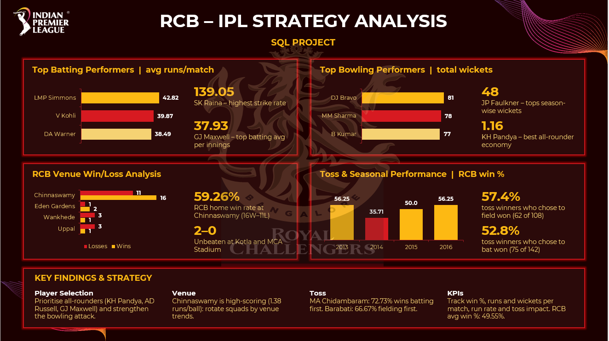

# RCB IPL Strategy Analysis | SQL Project
## Project Overview
This project uses SQL and IPL ball-by-ball data to analyze player performance, team performance, venue trends, toss impact, and strategic factors relevant to Royal Challengers Bangalore (RCB).
The analysis focuses on identifying high-impact and consistent players and generating data-driven insights to support player retention, auction strategy, and team planning.
## Objectives
- Analyze player batting and bowling performance.
- Identify consistent and high-impact players.
- Evaluate RCB's venue-wise win-loss performance.
- Analyze the impact of toss decisions on match outcomes.
- Develop strategic KPIs for team performance.
- Generate data-driven insights for auction and squad planning.
## Key Analysis
- Top players by batting average and strike rate
- Top wicket-takers and bowling performance
- Player performance across seasons
- Venue-wise RCB win-loss analysis
- Toss decision and match-result analysis
- Average runs and wickets per match
- Run rate and win percentage
- Venue-specific player performance
- All-rounder performance
- Player recommendations for auction strategy
## SQL Concepts Used
- SELECT, WHERE, GROUP BY, ORDER BY
- JOINs
- Subqueries
- Common Table Expressions (CTEs)
- CASE statements
- Aggregate Functions
- Window Functions
- LAG()
- RANK()
- INFORMATION_SCHEMA
- Filtering and Ranking
## Tools
- MySQL
- SQL
- IPL Ball-by-Ball Dataset
## Project Files
- `SQL/` – SQL queries used for the analysis
- `Presentation/` – Project presentation and insights
- `Documentation/` – Detailed project documentation
- `Images/` – Project preview/dashboard images
## Project Preview

## Key Findings
The analysis evaluates batting champions, bowling performers, venue-specific trends, toss impact, RCB's seasonal performance, and strategic KPIs.
The project also highlights the importance of all-rounder impact, bowling strength, venue-based squad planning, and data-driven tactical decisions.
## Conclusion
This project demonstrates how SQL can be used to transform IPL match and player data into actionable sports analytics insights. The analysis supports strategic thinking around player selection, auction planning, venue strategy, and team performance.
## Author
**Rajiv Kumar**
Data Analyst| SQL | Excel | Power BI | Python
